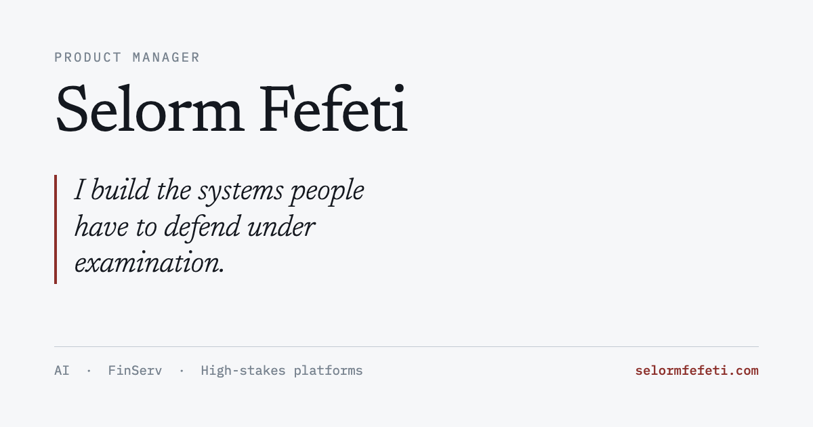

# selormfefeti.github.io

My product portfolio. Live at **<https://selormfefeti.github.io>**



Case studies from Intapp and Compliance Solutions Strategies, written around the
decisions rather than the outcomes. Also links a two-page summary and a resume.

## How it's built

One hand-written HTML page. No framework, and nothing to install beyond Python's
standard library.

- **`index.html`** is the content. It's a fragment with no doctype, head or body,
  because the same file is published as a Claude Artifact and that host supplies
  its own document shell.
- **`build.py`** wraps the fragment into `docs/` with the head a real host needs:
  charset, viewport, description, Open Graph tags, favicon. It also copies the
  PDFs and the preview image, and writes a `CNAME` when a custom domain is set.
- **GitHub Pages** serves the `main` branch, `/docs` folder.

Type is Newsreader, Public Sans and IBM Plex Mono from Google Fonts. The three
case-study diagrams are hand-authored inline SVG that follow the page's light and
dark themes.

## Updating it

Edit `index.html`, then:

```bash
python3 build.py
git add -A && git commit -m "update" && git push
```

Pages takes a minute or two, and its CDN caches for a little longer. If the site
looks unchanged straight after a push, wait before assuming it broke.

## Custom domain

`build.py` has `GH_USER`, `GH_REPO` and `DOMAIN` at the top. With `DOMAIN` empty
it targets github.io. Set it to a domain you own and re-run: the `CNAME` file and
every absolute URL update together.

## Not in the repo

Drafting notes and the print source for the PDF are gitignored. `docs/` holds
everything that actually ships.
